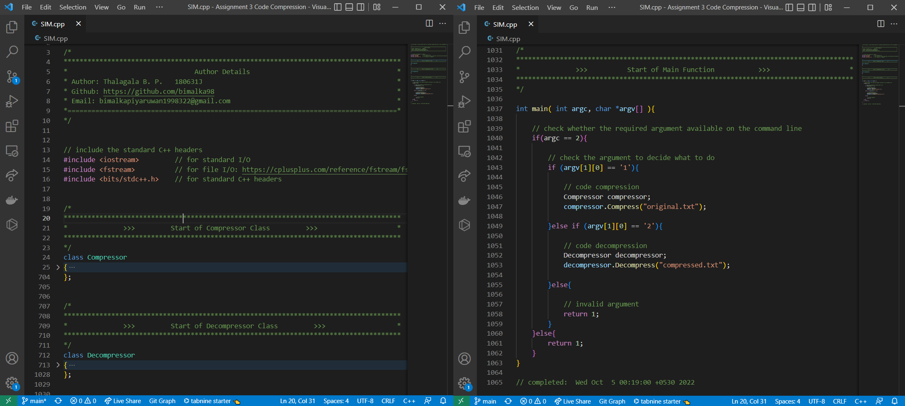

# Code Compression and Decompression

## Used Software 
1. **For coding** : [Visual Studio Code](https://code.visualstudio.com/)
2. **For Compilation** : [GCC C++ compiler (g++) and GDB debugger on Ubuntu in the Windows Subsystem for Linux (WSL)](https://learn.microsoft.com/en-us/windows/wsl/)



## Automated Testing

**Open the terminal in this directory and Execute the test.sh script!**

```shell
user@host:$ ./test.sh

===========================================================
|      © Copyright 2022 Bimalka Piyaruwan Thalagala       |
|                           ---                           |
|         Github: https://github.com/bimalka98            |
===========================================================

[TEST-INFO] compiling the source file...
Done!

[TEST-INFO] testing compression unit...
[TEST-INFO] identifying differences between "cout.txt" & "compressed.txt"...
Done!

[TEST-INFO] testing decompression unit...
[TEST-INFO] identifying differences between "dout.txt" & "original.txt"...
Done!

[TEST-INFO] removing temporary files...
Done!
```
## Manual Testing

### Command Line and Input/Output Formats

* The simulator can be executed with the following commands.

```shell
user@host:$ ./SIM 1  # for compression
user@host:$ ./SIM 2  # for decompression
```
* The input and output files have been hardcoded into code as follows:

  1. Input file for your compression function: **original.txt** // *can be changed at the main fucntion*
  2. Output produced by your compression function: **cout.txt**
  3. Input file for your decompression function: **compressed.txt** // *can be changed at the main fucntion*
  4. Output produced by your decompression function: **dout.txt**

* Compile to produce an executable named SIM.

```shell
user@host:$ g++ -std=c++0x SIM.cpp -o SIM
```

* Compress the input file (original.txt) and check with the expected output (compressed.txt)

```shell
user@host:$ ./SIM 1
user@host:$ diff -w -B  cout.txt compressed.txt
```

* Decompress the input file (compressed.txt) and check with the expected output (original.txt)

```shell
user@host:$ ./SIM 2
user@host:$ diff -w -B  dout.txt original.txt
```
