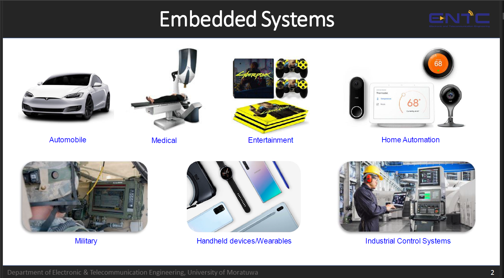

# Embedded Systems Engineering 📷

## Assignments

---

## References
* UOM's EN3240 - Embedded Systems Engineering: Lecture Notes and Lectures by [Dr. Subodha Charles](https://ent.uom.lk/team/dr-subodha-charles/)
