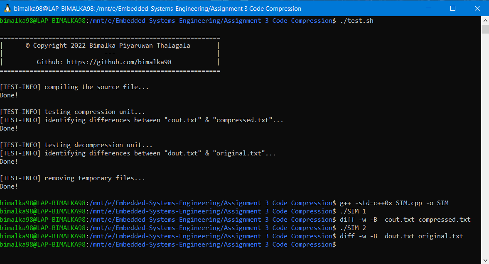

   <h1 align="center">Embedded Systems Engineering 📷</h1>
  

---
## *Assignments*

|Figure|Desciption|
|:---:|:---|
||**Modeling & Specification**  *Drawing a condition/event Petri net model for a library system* [[project]](Assignment%201%20Modeling%20%26%20Specification)|
|| **IoT Project**  *Building a node-red application to get the weather data in an user-provided location from OpenWeather; Extend that Weather Application to include a Weather Warning Device implemented with the NodeMCU* [[project]](Assignment%202%20IoT%20Project)|
|| **Real-time Scheduling**  *Testing whether a given set of tasks are schedulable on a single processor using Rate-Monotonic (RM) scheduling by applying both necessary and sufficiency tests; Rate Monotonic Scheduling; Earliest Deadline First Scheduling* [[project]](Assignment%204%20Real-time%20Scheduling)|
|| **Code Compression**  *Implementation of both code compression and decompression using  C++. The dictionary can have eight entries (index 3 bits) and the eight entries are selected based on frequency. TBC. Refer the **Assignment 3 - Instructions.pdf** in the linked project directory for all the instructions* [[project]](Assignment%203%20Code%20Compression)|

---

## References
* UOM's EN3240 - Embedded Systems Engineering: Lecture Notes and Lectures by [Dr. Subodha Charles](https://ent.uom.lk/team/dr-subodha-charles/)
